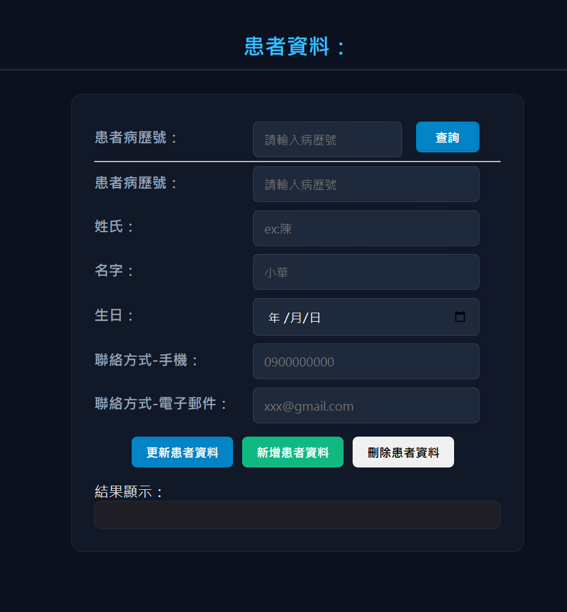
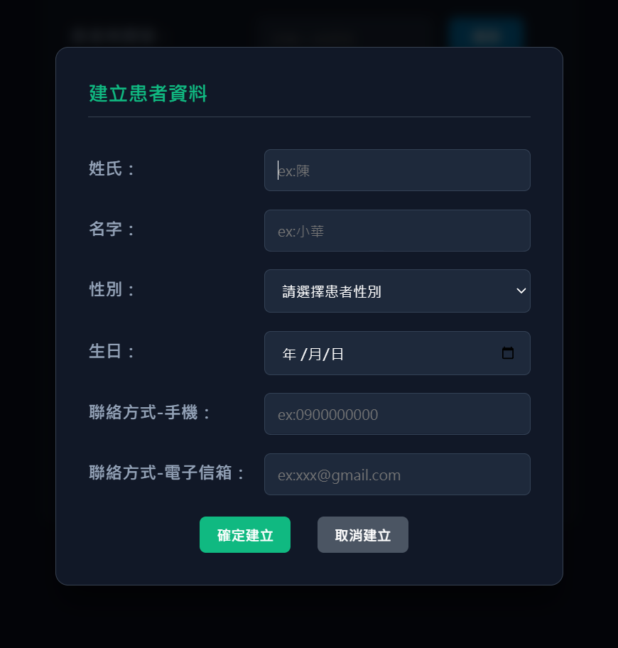
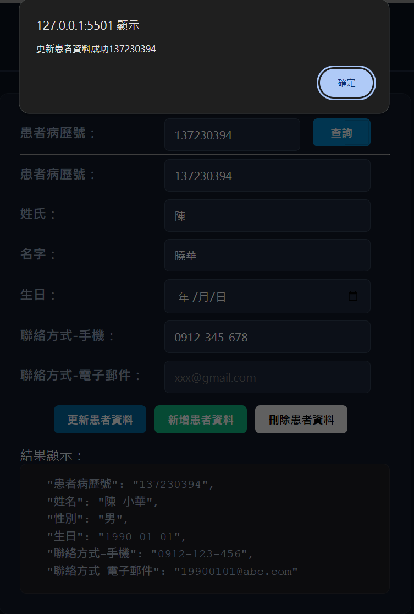
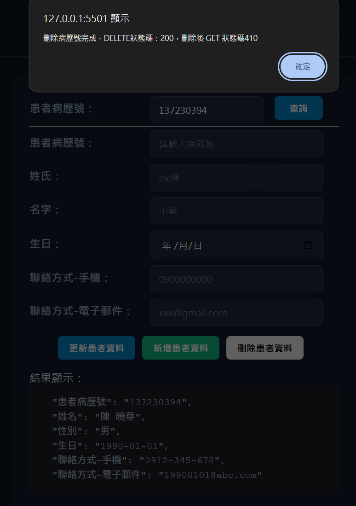

# HL7 FHIR Patient CRUD System

A web application for performing CRUD operations on HL7 FHIR Patient resources using Vanilla JavaScript and a HAPI FHIR Server.

---

## Project Motivation

This project was built to understand the structure of the HL7 FHIR Patient resource and practice creating, retrieving, updating, and deleting healthcare data through RESTful APIs.

It also helped me gain practical experience with JavaScript, API communication, and healthcare data standards.

---

## Features

- Create Patient resources
- Search Patient resources by ID
- Update Patient information
- Delete Patient resources
- Communicate with a HAPI FHIR Server through RESTful APIs

---

## Tech Stack

### Frontend

- HTML5
- CSS3
- Vanilla JavaScript (ES6)

### API

- Fetch API
- RESTful API

### Healthcare

- HL7 FHIR R4
- HAPI FHIR Server

### Version Control

- Git
- GitHub

---

## What I Learned

- Basic structure of the HL7 FHIR Patient resource
- RESTful API communication
- CRUD operations using JavaScript
- Frontend modularization and code organization

---

## Project Structure

```text
FHIR-PATIENT-CRUD
│
├── CSS
├── JS
│   ├── create.js
│   ├── search.js
│   ├── update.js
│   └── delete.js
├── images
├── patient.html
└── README.md
```

---

## API Endpoints

| Method | Endpoint | Description |
|---|---|---|
| GET | `/Patient/{id}` | Retrieve a Patient resource |
| POST | `/Patient` | Create a Patient resource |
| PUT | `/Patient/{id}` | Update a Patient resource |
| DELETE | `/Patient/{id}` | Delete a Patient resource |

---

## Workflow

```text
Enter a Patient ID
        │
        ▼
Retrieve Patient data
        │
        ▼
Display Patient information
        │
        ▼
Create / Update / Delete Patient data
        │
        ▼
Send request to the HAPI FHIR Server
        │
        ▼
Receive and display the response
```

---

## Screenshots

### Patient Dashboard



---

### Create Patient



---

### Update Patient



---

### Delete Patient



---

## Future Improvements

- Add form validation
- Improve UI and user experience
- Improve responsive design
- Add pagination for Patient search results
- Improve error and success messages
